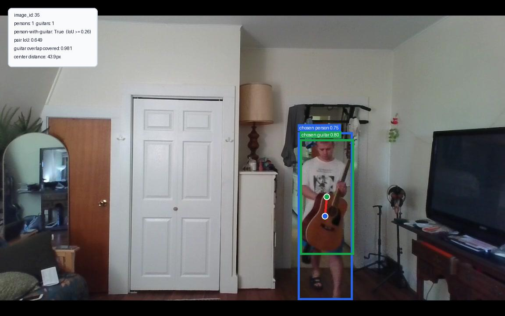
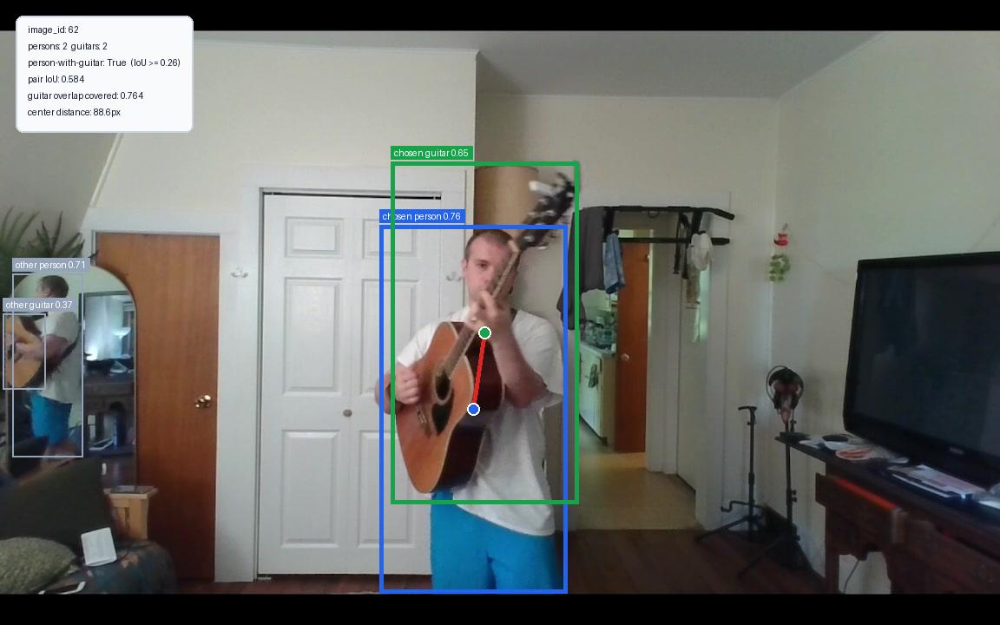
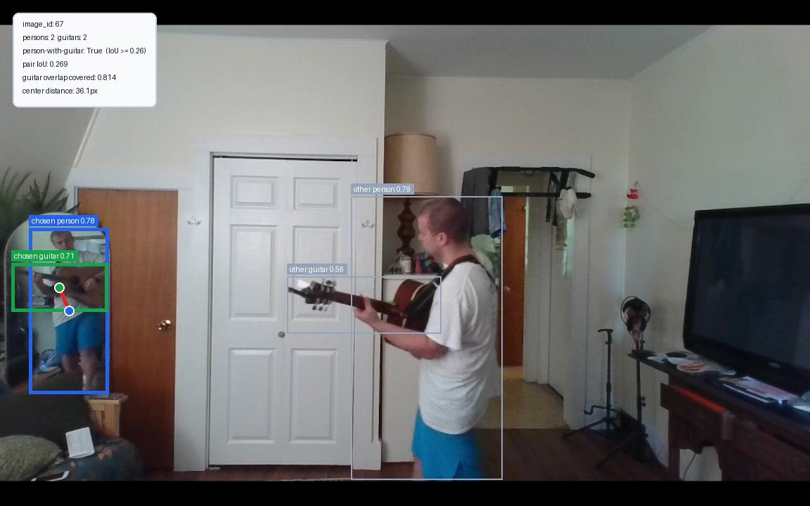
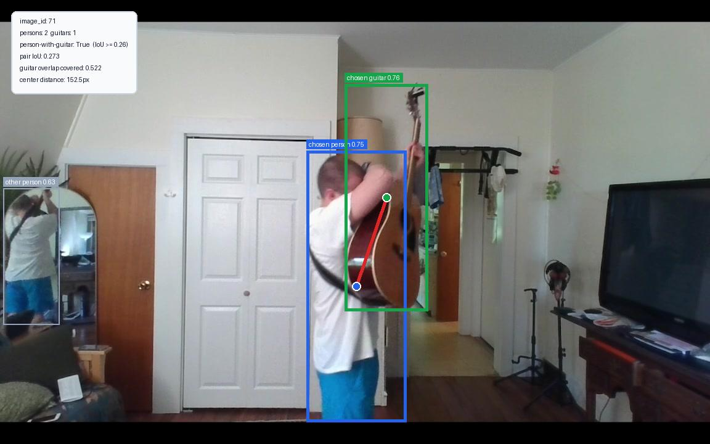
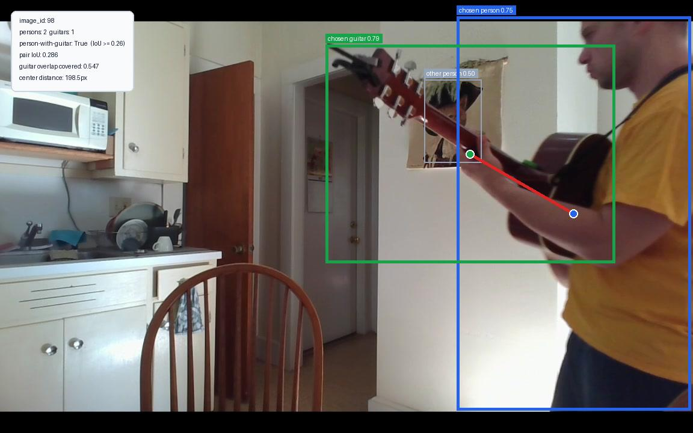
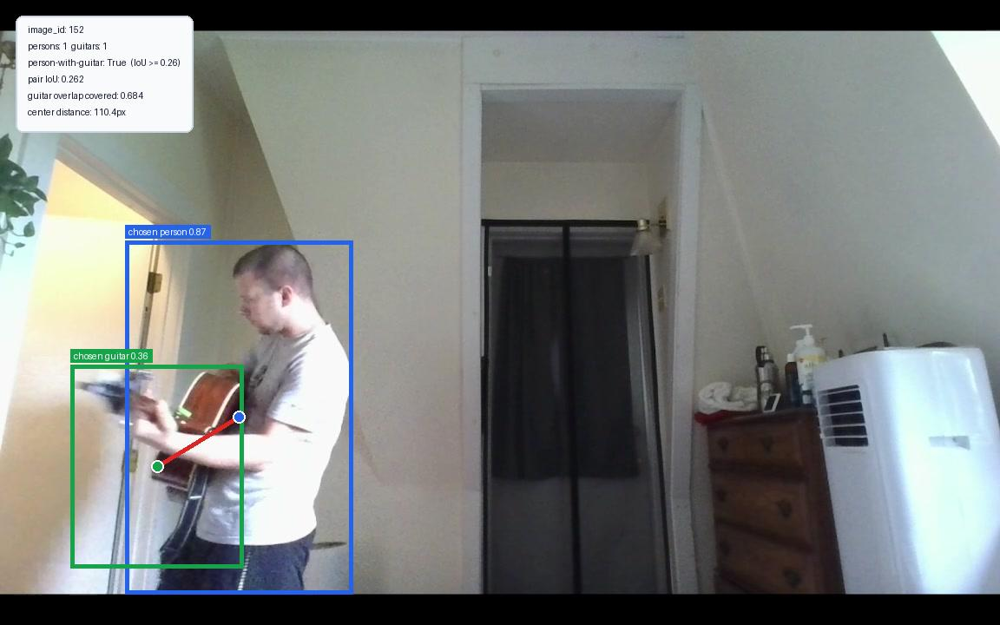
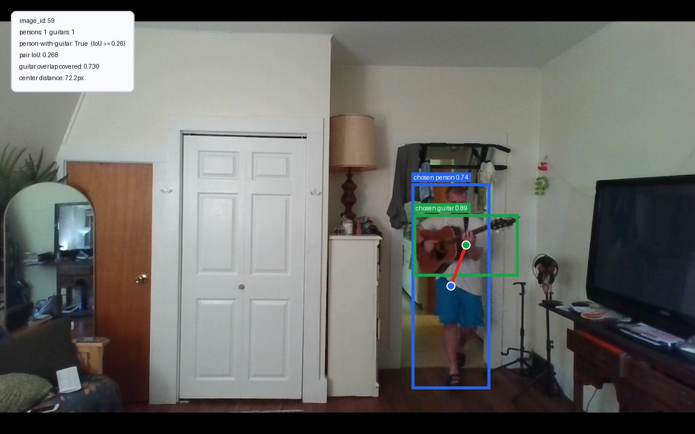
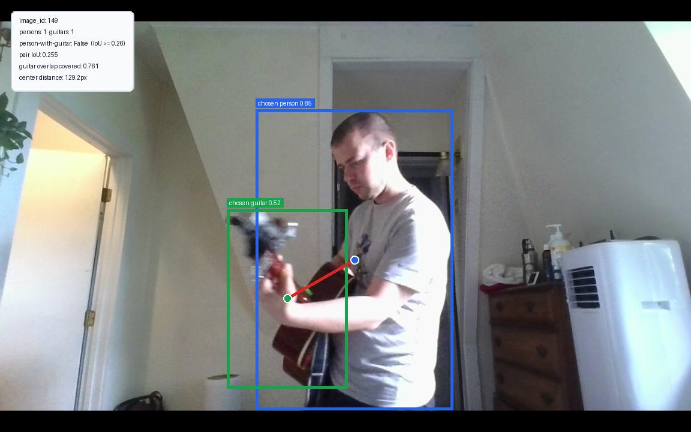
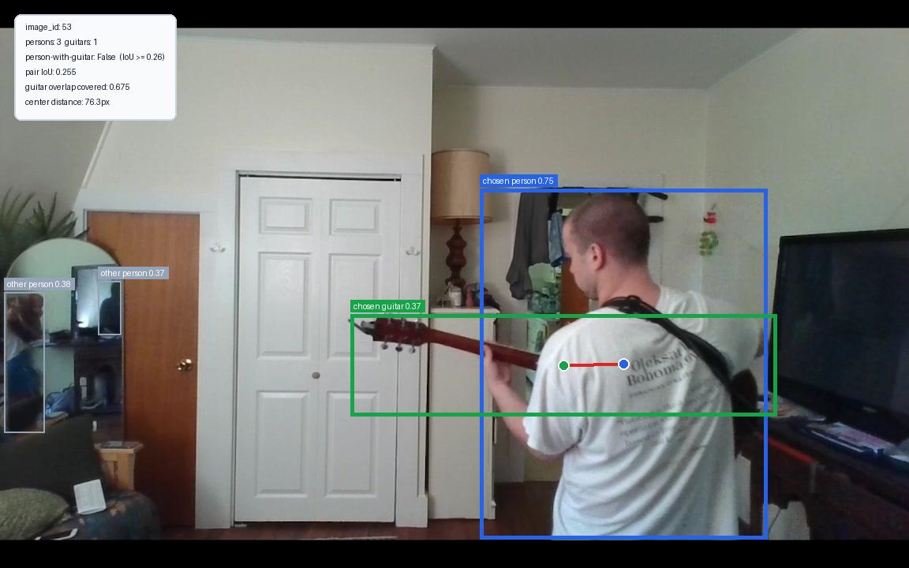

# Image-Level IoU Descriptive Report — person with guitar (2026-06-17)

Descriptive analytics of per-frame person/guitar detections (Grounding DINO).
A frame counts as **person-with-guitar** when the best person and guitar boxes
overlap with **IoU >= 0.26** (threshold from the IoU distribution via Otsu).
Repo: https://github.com/Sultanidza/life-monitoring

## Frame counts

- Total frames: **182**
- Person AND guitar detected: **129** (70.9%)
- **Person-with-guitar (IoU >= 0.26): 86** (47.2% of all frames)
- Person only: 40  |  guitar only: 2  |  neither: 11
- Both detected but **not overlapping (IoU = 0)**: 11 (co-present but apart — e.g. guitar on a stand)

## Average IoU (person vs guitar, frames with both)

- Mean: **0.296**  |  Median: **0.340**
- p25 / p75: 0.184 / 0.396  |  range 0.000-0.649
- Recommended threshold (Otsu): **0.260**

### IoU distribution

```
IoU range   | cnt | histogram
0.00-0.03 |  12 | ###########################
0.03-0.06 |   4 | #########
0.06-0.10 |   5 | ###########
0.10-0.13 |   3 | #######
0.13-0.16 |   5 | ###########
0.16-0.19 |   4 | #########
0.19-0.23 |   4 | #########
0.23-0.26 |   6 | #############
0.26-0.29 |   6 | #############  <- threshold
0.29-0.32 |  10 | ######################
0.32-0.36 |  18 | ########################################
0.36-0.39 |  14 | ###############################
0.39-0.42 |  17 | ######################################
0.42-0.45 |   3 | #######
0.45-0.49 |   7 | ################
0.49-0.52 |   5 | ###########
0.52-0.55 |   3 | #######
0.55-0.58 |   2 | ####
0.62-0.65 |   1 | ##
```

### Threshold sweep (frames counted as person-with-guitar)

| IoU threshold | frames | share of all |
|---|---|---|
| 0.00 | 129 | 70.9% |
| 0.05 | 115 | 63.2% |
| 0.10 | 108 | 59.3% |
| 0.15 | 102 | 56.0% |
| 0.20 | 94 | 51.6% |
| 0.25 | 89 | 48.9% |
| 0.30 | 77 | 42.3% |
| 0.40 | 30 | 16.5% |
| 0.50 | 9 | 5.0% |

## Decision rule

`person-with-guitar` = best person/guitar pair has IoU >= 0.26. This replaced an
earlier center-distance heuristic; IoU directly measures box overlap, which is what
'holding a guitar' looks like. The threshold is **descriptive** (from the distribution
shape), not yet validated against hand-labeled playing/not-playing frames.

## Example frames

Blue = chosen person, green = chosen guitar, panel shows the IoU verdict.

### Confident person-with-guitar (high overlap, guitar centered on person)

- **confident** (image 35): IoU `0.649`, guitar-overlap-covered `0.98`, guitar-center-in-person `True`, persons `1` guitars `1`
  
  
- **confident** (image 62): IoU `0.584`, guitar-overlap-covered `0.76`, guitar-center-in-person `True`, persons `2` guitars `2`
  
  

### Near-object false-positive risk (multiple people/guitars in frame)

Note: at IoU >= threshold, the guitar center is inside the person box in **all** 86
person-with-guitar frames, so peripheral overlaps do not pass. The remaining risk is
**multi-object scenes** — more than one person or guitar present — where the chosen
pair could be coincidental rather than the person actually playing.

- **near-object-fp** (image 67): IoU `0.269`, guitar-overlap-covered `0.81`, guitar-center-in-person `True`, persons `2` guitars `2`
  
  
- **near-object-fp** (image 71): IoU `0.273`, guitar-overlap-covered `0.52`, guitar-center-in-person `True`, persons `2` guitars `1`
  
  
- **near-object-fp** (image 98): IoU `0.286`, guitar-overlap-covered `0.55`, guitar-center-in-person `True`, persons `2` guitars `1`
  
  

### Borderline (just above the threshold)

- **borderline** (image 152): IoU `0.262`, guitar-overlap-covered `0.68`, guitar-center-in-person `True`, persons `1` guitars `1`
  
  
- **borderline** (image 59): IoU `0.268`, guitar-overlap-covered `0.73`, guitar-center-in-person `True`, persons `1` guitars `1`
  
  

### Near-miss (just below the threshold — counted as NOT playing)

- **near-miss** (image 149): IoU `0.255`, guitar-overlap-covered `0.76`, guitar-center-in-person `True`, persons `1` guitars `1`
  
  
- **near-miss** (image 53): IoU `0.255`, guitar-overlap-covered `0.68`, guitar-center-in-person `True`, persons `3` guitars `1`
  
  

## Caveats / next steps

- Rates are **descriptive**, not measured accuracy — no playing/not-playing labels yet.
- A small hand-labeled subset would turn the threshold into a validated precision/recall.
- Mirror reflections remain a known hard case for the underlying detector.
